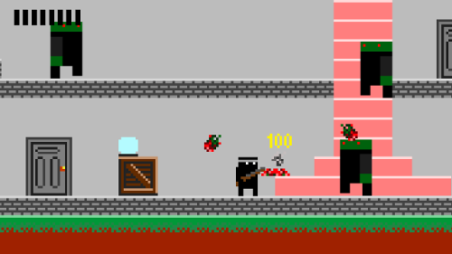
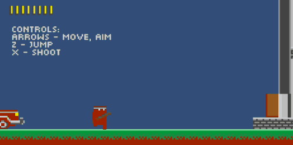

The game in this repository uses [Unity](http://unity3d.com/) engine to recreate a simplified version of the first level from ["Dangerous Dave in the Haunted Mansion"](http://www.mobygames.com/game/dangerous-dave-in-the-haunted-mansion).

You can play the game online in your web browser (unfortunately Unity Web Player doesn't work in Google Chrome, so you should use some other web browser like Firefox, Opera or Internet Explorer):  
http://newagebegins.github.io/unity_dave/WebBuild/WebBuild.html

Some notes about this implementation:
* Contains a simple mesh-based tilemap editor
* Raycasting is used instead of Unity's physics engine for character movement and collision detection. This approach (and some of the code) is borrowed from [CharacterController2D](https://github.com/prime31/CharacterController2D)
* No third-party assets were used

Screenshot:  

Gameplay GIF:  

